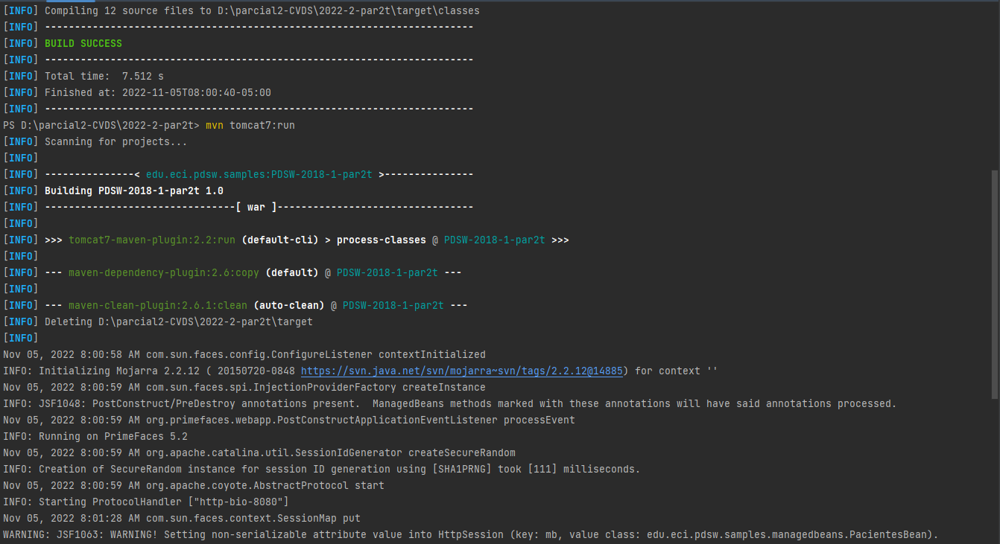
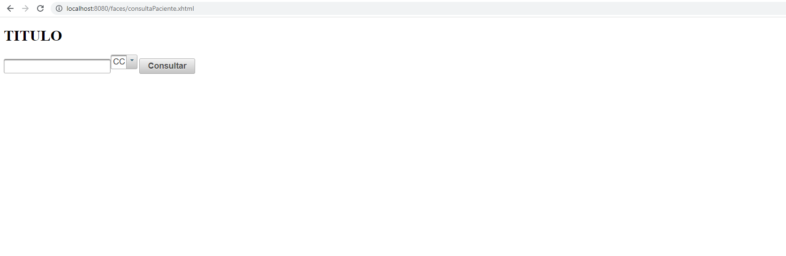
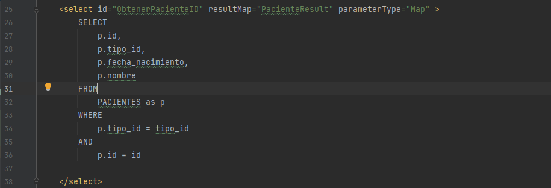
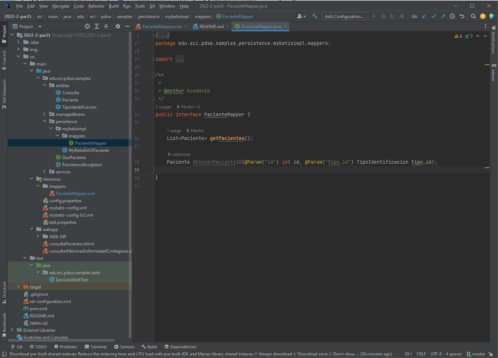
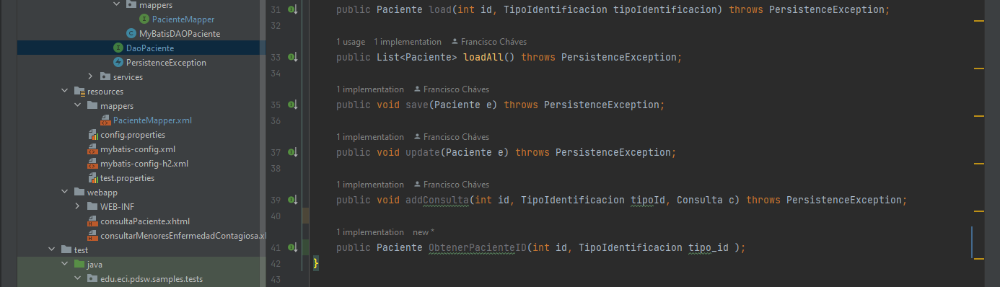

## Escuela Colombiana de Ingeniería

### PDSW – Procesos de desarrollo de Software
### Parcial Segundo Tercio

### Daniel Builes Gonzalez 

*Primero corremos el codigo usando los comandos 

    ```bash
    $ mvn compile
    ```
    ```bash
    $ mvn tomkat7:run
    ```



*Luego en internet aparece lo siguiente con la direccion http://localhost:8080/faces/consultaPaciente.xhtml



*Para crear la consulta la hacemos en la funcion PacienteMapper.xml en la carpeta resources/mappers



*Luego creamos un metodo que llama a la consulta desde la interfaz PacienteMapper, el metodo tiene como nombre ObtenerPacienteID



*Por ultimo la reflejamos en la clase y en la interfaz MyBatisDAOPaciente y DaoPaciente respectivamente


